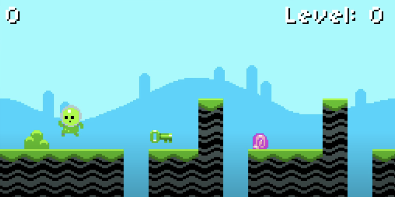

# Super Mario Bros

A side-scrolling platformer inspired by the NES classic, built with LÖVE2D for CS50's Game Development course.



## Description

Super Mario Bros is a retro-style 2D platformer that replicates the core mechanics of the original NES game. This project focuses on tile-based level design, sprite animation, and platforming physics with variable jump height.

Features include:

- Running and jumping mechanics with momentum
- Collision with platforms, blocks, and enemies
- Tile-based map rendering
- Parallax-scrolling background
- Classic Mario-style visuals and sound effects

## How to Play

### Controls

- `Left Arrow`: Move left  
- `Right Arrow`: Move right  
- `Space`: Jump  

### Objective

Reach the end of each level by avoiding enemies and navigating platforms. Collect coins and powerups along the way!

## Development

### Built With

- [LÖVE2D](https://love2d.org/) — 2D game framework  
- Lua — Programming language  
- Tilemap system with camera scrolling  
- Animated sprite systems and modular level loader

### Project Structure

- `main.lua` — Entry point and game loop  
- `src/` — Game logic, character, tilemap, and states  
- `graphics/` — Sprites and background assets  
- `sounds/` — Jumping, enemy, and background music  
- `fonts/` — UI font files  
- `lib/` — Class system and helper libraries

## Installation and Running

1. [Download and install LÖVE2D](https://love2d.org/)
2. Clone the repository:
   ```bash
   git clone https://github.com/ethanperello/super-mario-bros.git
   ```
3. Run the game:
   ```bash
   love super-mario-bros
   ```

## Demo

[Watch the gameplay demo](https://www.youtube.com/watch?v=EtEtVQGwuf4)

## Credits

- Developed by Ethan Perello  
- Created as part of CS50's Game Development course  
- Assets inspired by classic Mario games
